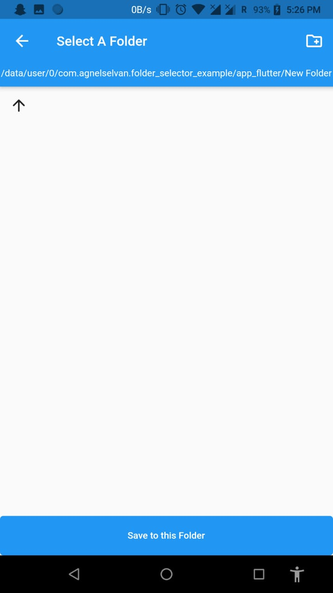

# Folder Selector

[](https://pub.dev/packages/folder_selector)

A new Flutter Plugin for selecting Folder in Android and IOS


       

## Usage

A File Selector Page is Available 
On Selecting a folder return the path as String Format
```dart
import 'package:folder_selector/folder_selector.dart';
String path = await Navigator.of(context).push<String>(MaterialPageRoute(builder: (context) => FolderSelector(rootDir: rootDir,) ));
```

## Parameters
- **rootDir** `Directory` *required* : To start from which Directory the path has to be selected
- **title** `String` : Title of the Folder Selector Page

## Permissions

```xml
<uses-permission android:name="android.permission.WRITE_EXTERNAL_STORAGE" />
<uses-permission android:name="android.permission.READ_EXTERNAL_STORAGE" />
```
